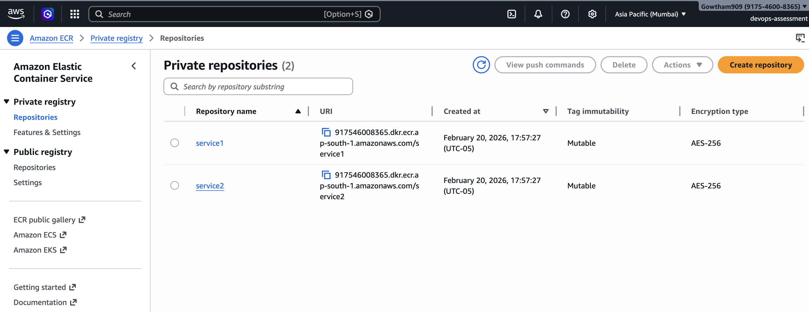
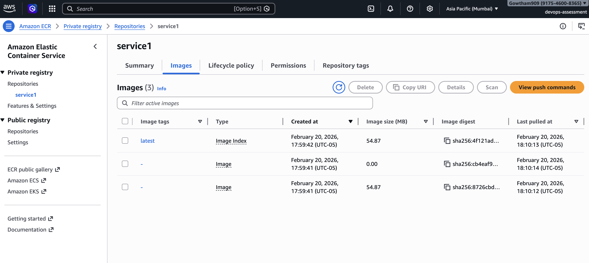
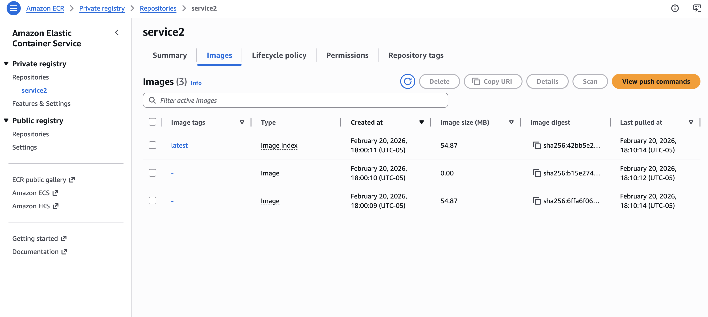
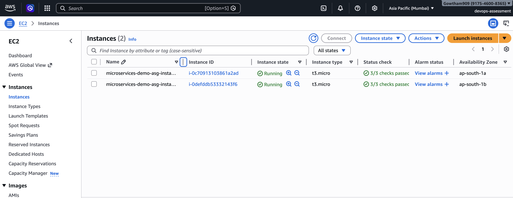
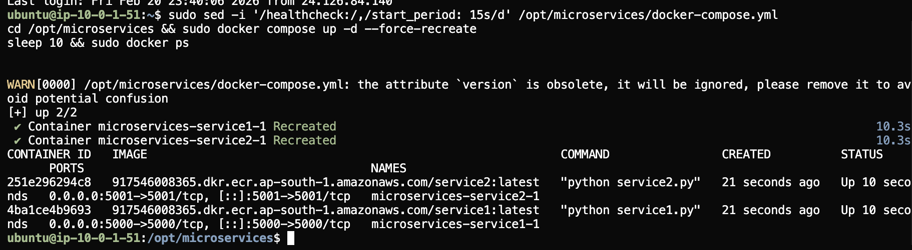
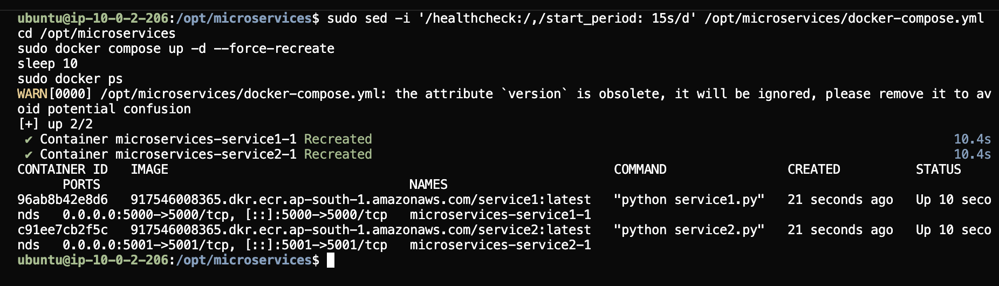
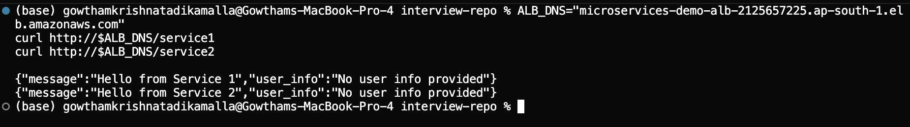
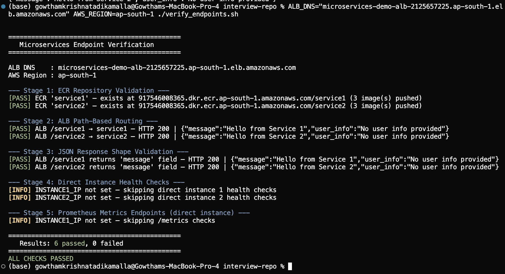
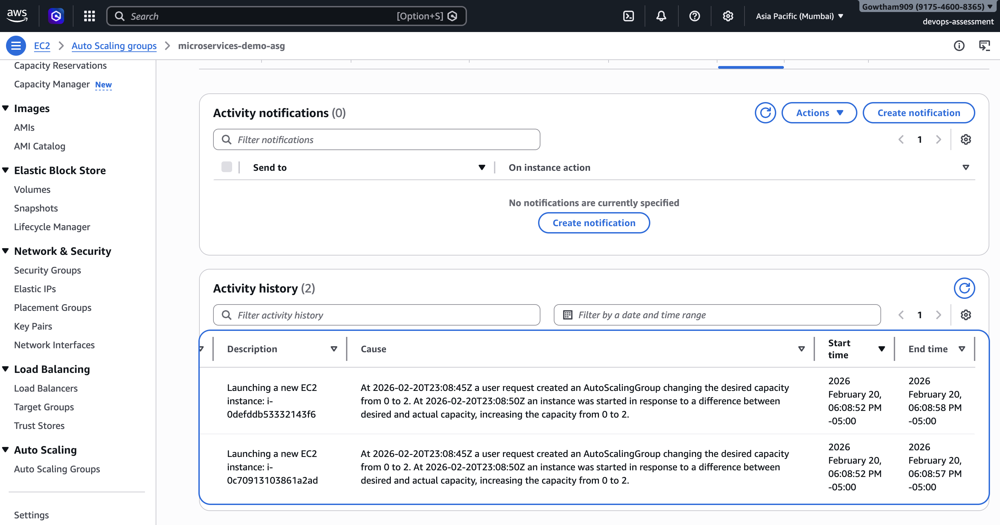

# Microservices Deployment on AWS

This repo contains everything needed to deploy two containerized Flask services to AWS — from building and pushing Docker images to ECR, running them on EC2 behind an ALB, and provisioning the entire infrastructure with Terraform including an Auto Scaling Group.

---

## Architecture

```
                        Internet
                            |
                          HTTP :80
                            |
               +---------------------------+
               |  Application Load Balancer|
               |     (ap-south-1)          |
               +---------------------------+
                  |                    |
         /service1*              /service2*
                  |                    |
        +----------+          +----------+
        | Target   |          | Target   |
        | Group 1  |          | Group 2  |
        | :5000    |          | :5001    |
        +----------+          +----------+
                  \                /
                   \              /
            +----------------------+
            |  Auto Scaling Group  |
            |  min=2 desired=2     |
            |  max=4               |
            |                      |
            |  [EC2 t3.micro AZ-1] |
            |  [EC2 t3.micro AZ-2] |
            +----------------------+
                        |
                   docker pull
                        |
               +------------------+
               |   Amazon ECR     |
               | service1:latest  |
               | service2:latest  |
               +------------------+
```

**Region:** ap-south-1 (Mumbai)

Both EC2 instances run both services simultaneously. The ASG uses a Launch Template with a user-data script that installs Docker, authenticates to ECR, and starts the containers automatically on boot.

---

## Services

| Service  | Port | Endpoints                              |
|----------|------|----------------------------------------|
| service1 | 5000 | `/`, `/service1`, `/health`, `/metrics` |
| service2 | 5001 | `/`, `/service2`, `/health`, `/metrics` |

Both are Python Flask apps. The `/metrics` endpoint exposes Prometheus metrics via `prometheus-flask-exporter`. Health checks return `{"status": "healthy"}` with HTTP 200.

---

## Repo Structure

```
interview-repo/
├── README.md
├── verify_endpoints.sh            # Health check and verification script
├── servers/
│   ├── docker-compose.yml         # Local development (builds from source)
│   ├── docker-compose.prod.yml    # EC2 deployment (pulls images from ECR)
│   ├── service1/
│   │   ├── service1.py
│   │   ├── requirements.txt
│   │   └── Dockerfile
│   └── service2/
│       ├── service2.py
│       ├── requirements.txt
│       └── Dockerfile
└── terraform/
    ├── main.tf                    # Provider config, AMI data source
    ├── variables.tf               # Input variables
    ├── outputs.tf                 # ALB DNS, ECR URLs, etc.
    ├── vpc.tf                     # VPC, subnets, IGW, routes
    ├── security_groups.tf         # ALB SG + EC2 SG
    ├── ecr.tf                     # ECR repositories
    ├── iam.tf                     # EC2 IAM role + ECR pull policy
    ├── alb.tf                     # ALB, target groups, listener rules
    ├── asg.tf                     # Launch Template, ASG, scaling policies
    └── user_data.tpl              # EC2 bootstrap script
```

---

## docker-compose.yml (EC2 Instances)

The file used on EC2 instances is `servers/docker-compose.prod.yml`. It pulls images from ECR rather than building from source:

```yaml
services:
  service1:
    image: <ECR_REGISTRY>/service1:latest
    ports:
      - "5000:5000"
    restart: unless-stopped

  service2:
    image: <ECR_REGISTRY>/service2:latest
    ports:
      - "5001:5001"
    restart: unless-stopped
```

On ASG instances this file is written by the user-data bootstrap script with the actual ECR registry URI already substituted — no manual steps needed.

---

## Prerequisites

- AWS CLI v2 (`aws configure` with an IAM user that has EC2, ECR, ELB, ASG, IAM, CloudWatch permissions)
- Terraform >= 1.6.0
- Docker with `buildx` support

---

## Deployment Steps

### 1. Create EC2 key pair

```bash
aws ec2 create-key-pair \
  --key-name microservices-key \
  --region ap-south-1 \
  --query 'KeyMaterial' --output text > ~/.ssh/microservices-key.pem

chmod 400 ~/.ssh/microservices-key.pem
```

### 2. Get your public IP

```bash
MY_IP=$(curl -s https://checkip.amazonaws.com)
```

### 3. Create ECR repositories and push images

```bash
cd terraform
terraform init

terraform apply \
  -target=aws_ecr_repository.service1 \
  -target=aws_ecr_repository.service2 \
  -var="ec2_key_name=microservices-key" \
  -var="my_ip_cidr=${MY_IP}/32"

ECR_REGISTRY=$(terraform output -raw ecr_registry)

aws ecr get-login-password --region ap-south-1 \
  | docker login --username AWS --password-stdin $ECR_REGISTRY

cd ../servers

# Build for linux/amd64 (required when building on macOS M-series)
docker buildx build --platform linux/amd64 \
  -t $ECR_REGISTRY/service1:latest --push ./service1

docker buildx build --platform linux/amd64 \
  -t $ECR_REGISTRY/service2:latest --push ./service2
```

### 4. Deploy full infrastructure

```bash
cd ../terraform

terraform apply \
  -var="ec2_key_name=microservices-key" \
  -var="my_ip_cidr=${MY_IP}/32"
```

This creates the VPC, subnets, security groups, IAM role, ALB, target groups, Launch Template, and the Auto Scaling Group. The ASG launches 2 t3.micro instances that boot, pull the ECR images, and start the services automatically.

Wait around 3–4 minutes for instances to pass the ALB health checks.

### 5. Quick test

```bash
ALB_DNS=$(terraform output -raw alb_dns_name)

curl http://$ALB_DNS/service1
# {"message":"Hello from Service 1","user_info":"No user info provided"}

curl http://$ALB_DNS/service2
# {"message":"Hello from Service 2","user_info":"No user info provided"}
```

---

## Running the Verification Script

```bash
cd ..

ALB_DNS=<alb-dns-name> AWS_REGION=ap-south-1 ./verify_endpoints.sh
```

To also test health endpoints directly on the instances (bypassing the ALB):

```bash
ALB_DNS=<alb-dns-name> \
INSTANCE1_IP=<ec2-public-ip-1> \
INSTANCE2_IP=<ec2-public-ip-2> \
AWS_REGION=ap-south-1 \
./verify_endpoints.sh
```

The script runs these checks and exits with code 0 if everything passes, 1 if anything fails:

- ECR `service1` repository exists and has at least 1 image
- ECR `service2` repository exists and has at least 1 image
- `GET /service1` via ALB → HTTP 200, body contains "Hello from Service 1"
- `GET /service2` via ALB → HTTP 200, body contains "Hello from Service 2"
- JSON response contains `"message"` field
- (Optional) Direct `/health` checks on both services on both instances

---

## Security

- **EC2 service ports (5000/5001)** only accept connections from the ALB security group — not reachable from the public internet directly
- **SSH (port 22)** is restricted to the operator's IP address only
- **IAM role** on EC2 uses a custom least-privilege policy: `ecr:GetAuthorizationToken` (required globally by AWS) and image pull actions scoped specifically to the `service1` and `service2` repository ARNs
- **EBS volumes** are encrypted at rest

---

## Auto Scaling Group (Terraform Bonus)

| Setting | Value |
|---------|-------|
| Min / Desired / Max | 2 / 2 / 4 |
| Instance type | t3.micro (free tier eligible in ap-south-1) |
| Scale-out trigger | CPU > 40% for 5 minutes |
| Scale-in trigger | CPU < 20% for 10 minutes |
| Health check type | ELB (ALB health checks) |
| Monitoring | Standard (5-min CloudWatch metrics, free tier) |

The Launch Template user-data script handles the full bootstrap on every new instance:
1. Installs Docker CE from the official Docker apt repository
2. Installs AWS CLI v2
3. Authenticates to ECR using the instance IAM role
4. Writes `/opt/microservices/docker-compose.yml` with the ECR image URIs
5. Runs `docker compose up -d`
6. Sets up a cron job to refresh the ECR auth token every 6 hours

---

## Screenshots

> Screenshots and command output are included below as evidence of each deployment stage.

### Stage A — ECR Repositories

**ECR Repositories list (service1 + service2):**



**service1 images (3 pushed, `latest` tag):**



**service2 images (3 pushed, `latest` tag):**



### Stage B & C — EC2 Instances + docker ps

**EC2 Instances (2 x t3.micro, Running, 3/3 health checks passed):**



**Instance 1 — docker ps:**



**Instance 2 — docker ps:**



### Stage D — ALB DNS + curl Responses



### Stage E — Verification Script (6/6 checks passed)



### Bonus — ASG Scale-Out Event



---

## Cleanup

All AWS resources provisioned for this assessment have been torn down using:

```bash
cd terraform
terraform destroy \
  -var="ec2_key_name=microservices-key" \
  -var="my_ip_cidr=$(curl -s https://checkip.amazonaws.com)/32"
```

No AWS resources from this deployment are still running.
